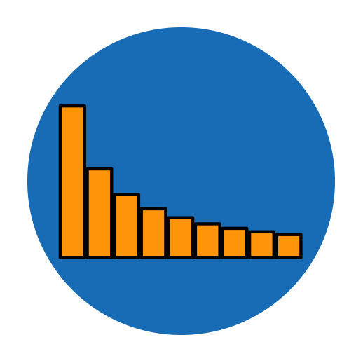

  

<h3 align="center">Benford</h3>

Validate if a distribution fits the "Benford's law compliance theorem"

    
    
    

---
# Benford's Law

This repository contains functions to validate if a distribution fits the "Benford's law compliance theorem"

---
## License

[MIT](https://choosealicense.com/licenses/mit/)

